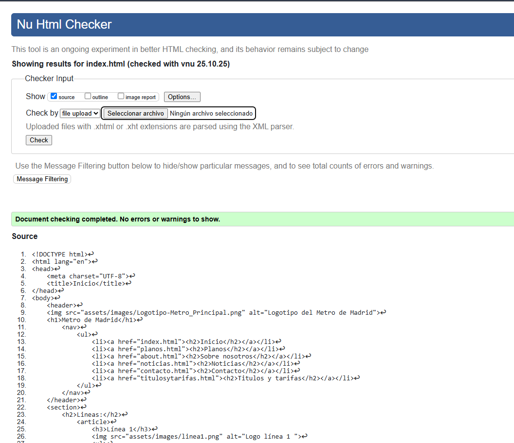
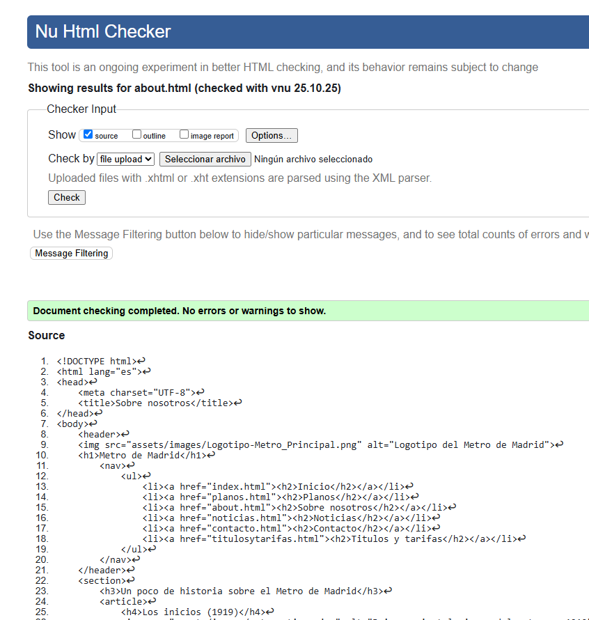
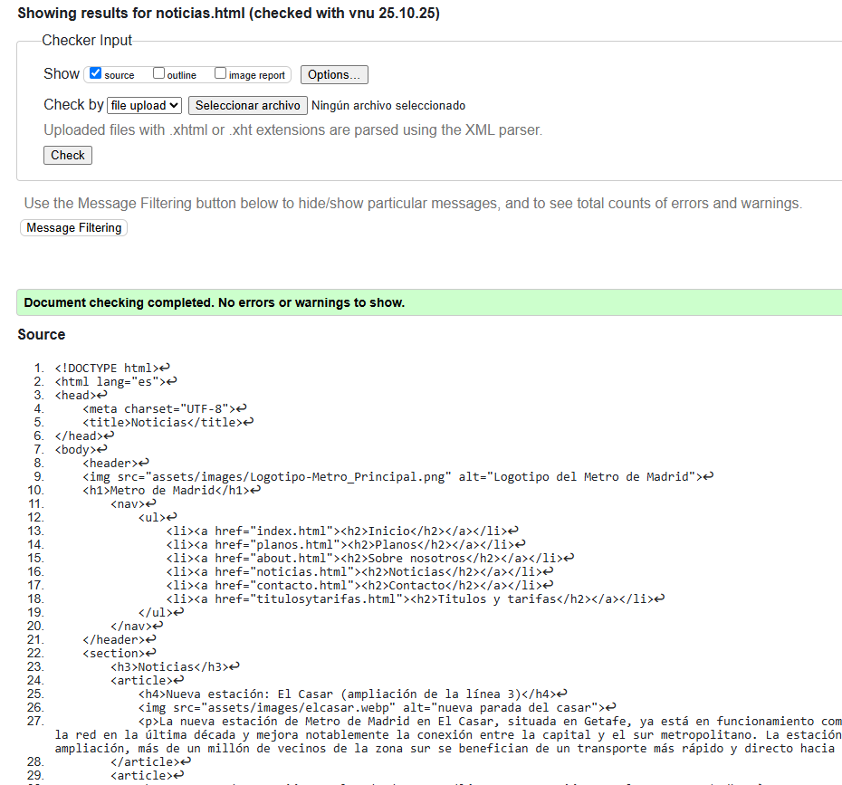
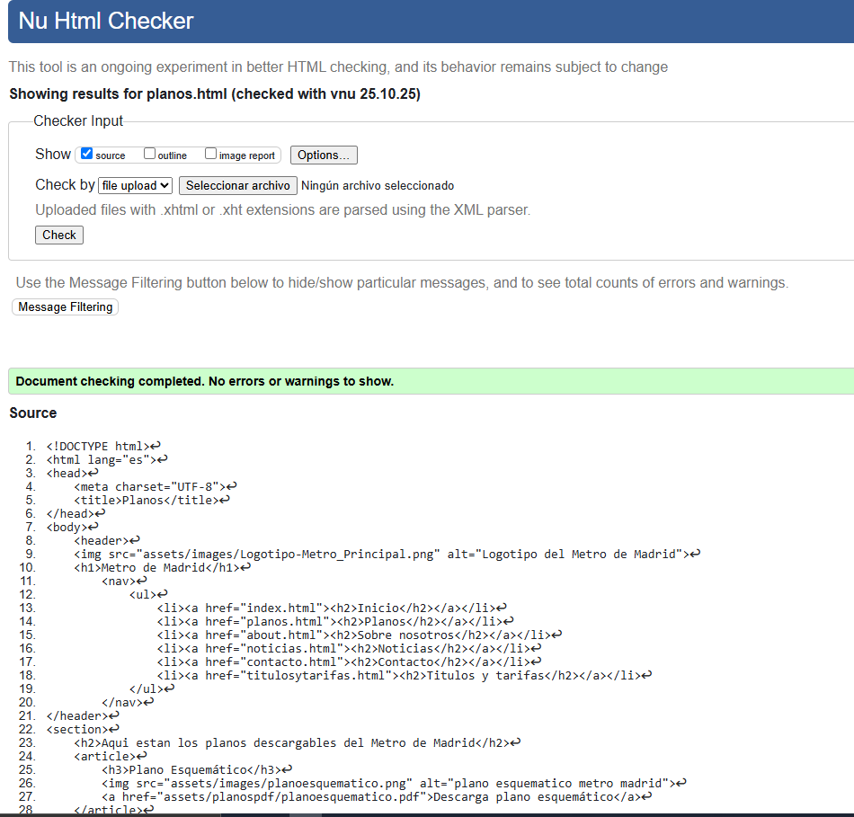
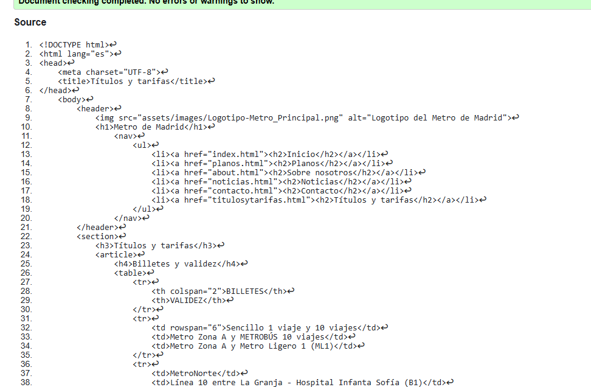

# Proyecto: Metro de Madrid – Página Informativa
Este proyecto es una página web dedicada al Metro de Madrid. Incluye varias secciones como historia, planos, noticias, títulos y tarifas, además de un formulario de contacto.

## Tecnologías utilizadas
- HTML5
- Uso de etiquetas semánticas (`header`, `section`, `article`, `footer`)
- Imágenes locales para acompañar el contenido

## Contenido del sitio
- **Página principal** con líneas y estaciones.
- **Historia del Metro de Madrid**, organizada por etapas.
- **Noticias** relacionadas con ampliaciones y mejoras.
- **Planos descargables** en PDF.
- **Títulos y tarifas**, incluyendo tablas detalladas.
- **Formulario de contacto** para consultas.

## Dificultades encontradas
La parte más compleja del proyecto fue la creación de las tablas en la sección de Títulos y Tarifas. Trabajar con celdas combinadas, filas largas y mantener la legibilidad resultó complicado al principio, pero tras varias pruebas y organización del contenido, se consiguió una estructura clara y funcional.

## Estado del proyecto
El proyecto se encuentra terminado, aunque en las siguentes practicas se le añadira:
- Estilos con CSS.

## Validaciones en W3C

## Autor
Jesús Rodríguez Rodríguez
